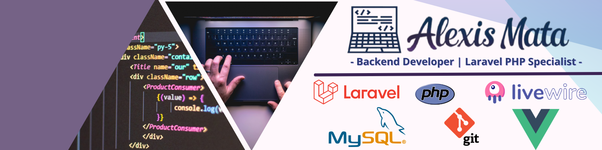

 

---

## 👋 Hola / Hello

Soy un desarrollador backend de Venezuela con más de 5 años de experiencia especializado en el ecosistema **PHP y Laravel**. Me apasiona crear **soluciones eficientes, escalables y fáciles de mantener**, desde API RESTful robustas hasta estructuras de bases de datos optimizadas. Me encanta convertir problemas complejos en software sencillo y eficaz.

- 🔭 Actualmente trabajo en **proyectos independientes** y perfecciono mis habilidades en **Vue.js**.
- 🌱 Estoy aprendiendo **arquitectura de software, TDD y profundizando mis conocimientos de Vue.js**.
- 👯 Busco colaborar en **proyectos Laravel de código abierto** o en startups innovadoras.
- 💼 Mi experiencia incluye: **Laravel, PHP, MySQL, API REST, Git**.

---

I'm a Backend Developer from Venezuela with over 5 years of experience specializing in the **PHP and Laravel** ecosystem. I'm passionate about building **efficient, scalable, and maintainable solutions**, from robust RESTful APIs to optimized database structures. I thrive on turning complex problems into simple and effective software.

- 🔭 I’m currently working on **freelance projects** and sharpening my skills in **Vue.js**.
- 🌱 I’m learning **Software Architecture, TDD, and Deepening my Vue.js knowledge**.
- 👯 I’m looking to collaborate on **open-source Laravel projects** or innovative startups.
- 💼 My expertise includes: **Laravel, PHP, MySQL, API REST, Git**.

---

<h3>:wave: My Skills :wave:</h3> 
Language:

FrameWorks:

Databases Managers:

IDE Enviroment & Dev Tools:

